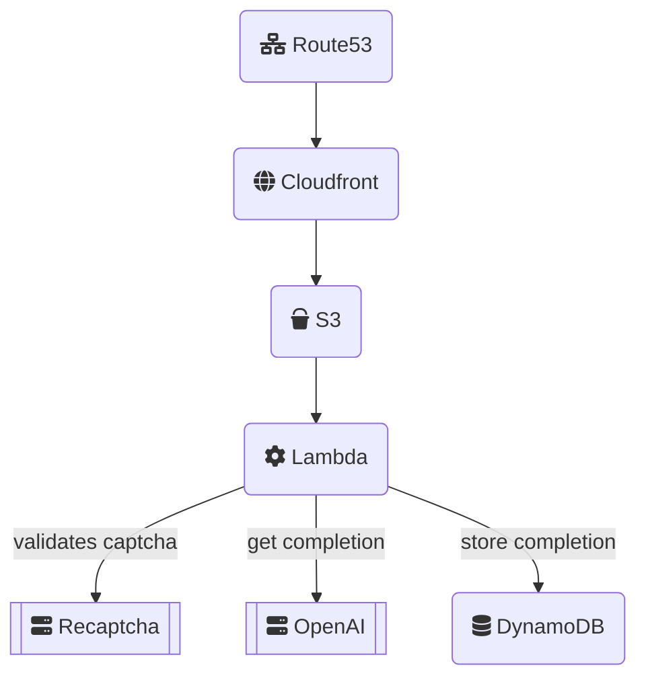

# Overview
This repo contains everything for a web application that uses AI to generate viral Linkedin posts.

# Architecture


# Folder structure
```
.
├── back                    # Backend files
├── front                   # Frontend files
├── model                   # AI training files
├── terraform               # Infrastructure code
└── ...
```